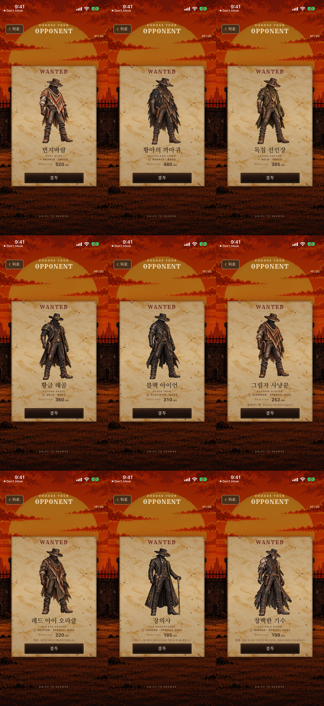
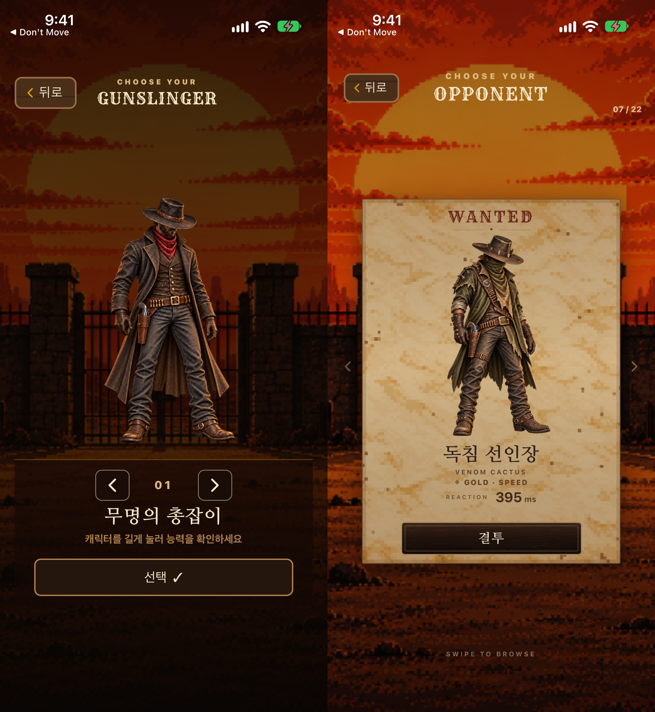

# NPC SELECT V3 — HIGH-RES PRODUCTION LOCK

## Final status

```text
HIGH_RES_SOURCE=22/22
HIGH_RES_POSTER=22/22
IDENTITY_MATCH=22/22
RIM_LIGHT_REMOVED=22/22
ALPHA_PASS=22/22
CLIPPING_PASS=22/22
DEVICE_QA=PASS
PERFORMANCE_QA=PASS
PLAYER_NPC_QUALITY_COMPARE=PASS

NPC SELECT V3
HIGH-RES PRODUCTION LOCKED
```

## Production mapping

- NPC 01–22 use their existing `clarity/npc/XX/idle.png` 1254×1254 native master as source.
- NPC Select uses `clarity/npc/XX/identity_poster.png`, also 1254×1254 native.
- The approved C treatment removes only the selected exterior red/orange cinematic rim pixels. No resize, resampling, AI generation, blur, smoothing, or sharpening is used.
- The original alpha channel is byte-identical for all 22 assets. Intentional transparency is retained.
- Every runtime entry in `POSTER_NPC_IDENTITIES` points to the new high-resolution poster derivative. Legacy low-resolution derivatives remain in the repository and are recorded as deprecated.
- NPC Select mounts the current poster portrait only. The adjacent controls are lightweight chevrons, so the carousel does not mount or decode all 22 posters together.

The asset provenance and hashes are recorded in [`npc-high-res-poster-manifest.json`](../assets/images/characters/npc-high-res-poster-manifest.json) and merged into [`poster-manifest.json`](../assets/images/characters/poster-manifest.json).

## Asset and regression QA

- Native source resolution: 22/22 at 1254×1254.
- Native poster resolution: 22/22 at 1254×1254.
- Source and output hashes match the production manifest: 22/22.
- Source/poster alpha equality: 22/22, zero changed alpha pixels.
- Visible RGB changes equal the recorded rim-mask selection count for every NPC; unselected visible pixels remain unchanged.
- Complete 1254px canvases render with `contain`, with no runtime crop. Full-roster parchment and dark-background sheets show the complete character canvases without poster clipping.
- NPC Duel pose files (`idle`, `draw`, `fire`, `hit`, `down`) match the pre-production baseline: 110/110 unchanged.
- Player 01–04 poster derivatives match the pre-production baseline: 4/4 unchanged.
- Pale Rider release lock logic is unchanged: release-locked remains `???` plus the approved silhouette; DEV/actual-unlocked uses the new high-resolution poster.

Machine-readable results are in [`qa-audit.json`](../artifacts/npc-high-res-production/qa-audit.json). Full-roster review sheets are in [`artifacts/npc-high-res-production`](../artifacts/npc-high-res-production/).

## Device QA

iPhone 17 Pro simulator captures were reviewed for NPC 01, 03, 07, 09, 12, 15, 18, 21, and 22 DEV. All nine show the correct character, name/tier, full-body scale, sharp poster art, and the approved background/poster composition.



The full-resolution captures are:

- [`NPC 01`](../artifacts/npc-high-res-production/device-npc01.png)
- [`NPC 03`](../artifacts/npc-high-res-production/device-npc03.png)
- [`NPC 07`](../artifacts/npc-high-res-production/device-npc07.png)
- [`NPC 09`](../artifacts/npc-high-res-production/device-npc09.png)
- [`NPC 12`](../artifacts/npc-high-res-production/device-npc12.png)
- [`NPC 15`](../artifacts/npc-high-res-production/device-npc15.png)
- [`NPC 18`](../artifacts/npc-high-res-production/device-npc18.png)
- [`NPC 21`](../artifacts/npc-high-res-production/device-npc21.png)
- [`NPC 22 DEV`](../artifacts/npc-high-res-production/device-npc22-dev.png)

## Player versus NPC quality

The Player 01 Character Select capture and NPC 07 NPC Select capture use their native 1254px poster sources. At the actual app display scale, the NPC is no longer visibly low-resolution or blurred compared with the player.



## Carousel performance

Initial NPC Select entry and a complete 01→22→01 carousel traversal completed without a crash, wrong mapping, visible stall, or missing poster. Rendering stays limited to the current poster portrait. This is an iPhone 17 Pro simulator observational pass; it is not an Instruments memory profile or a physical-device frame-time measurement.

